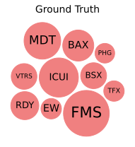
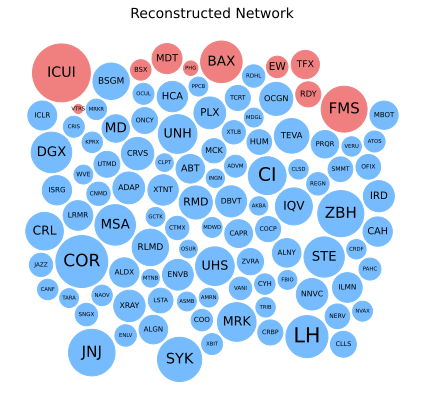

# `DELAY-finance`

### This repository is a proof-of-concept using the supervised deep-learning algorithm DELAY to reconstruct causal price-spillover networks from stock market time series

---

### What is DELAY?

- `DELAY` is a bioinformatics algorithm that uses transfer learning to reconstruct causal feature-interaction networks from noisy time-series data
- The [original algorithm](https://www.github.com/calebclayreagor/DELAY) accurately infers causal interactions by combining convolutional feature extraction with autoregressive modeling
- After fine-tuning on small ground-truth datasets, DELAY achieves [state-of-the-art performance](https://academic.oup.com/pnasnexus/article/2/4/pgad113/7095273) identifying causal _vs._ merely correlated signals

### Causal Network Reconstruction

- Like biological networks, stock prices are highly correlated and form feedback loops, violating basic assumptions of many causal inference methods
- DELAY frames causal discovery as a binary classification task where features (_i.e._, nodes) are either interacting (`A`->`B`) or non-interacting (`A`-x->`B`)
- To infer causal interactions between stock prices, DELAY needs ground-truth information that clearly defines the directionality of edges (_e.g._, `X`->`Y`)

### FDA Recalls & Price Spillover

- In [`ground-truth-network.ipynb`](notebooks/ground-truth-network.ipynb), I used FDA recall dates and daily market-adjusted returns to identify price spillover events between publicly traded securities
- FDA recalls are excellent ground-truth data for training DELAY because the resulting price shocks originate at a recalling company `X` and spillover at a competitor `Y`

 

 

